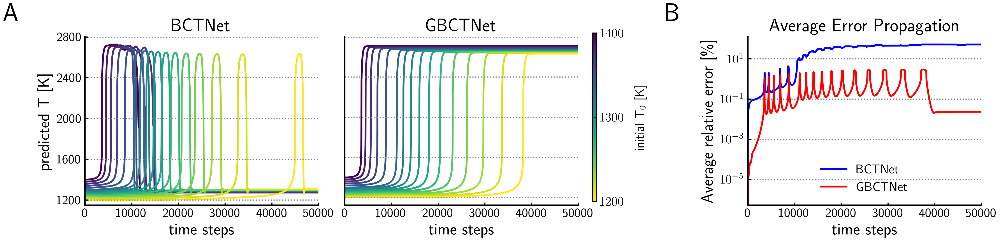
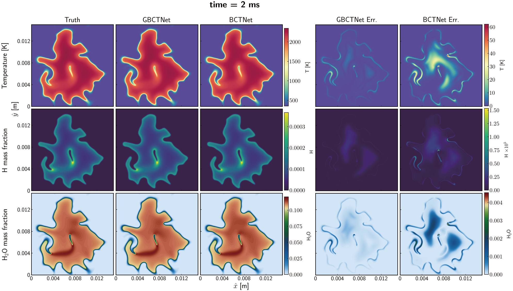
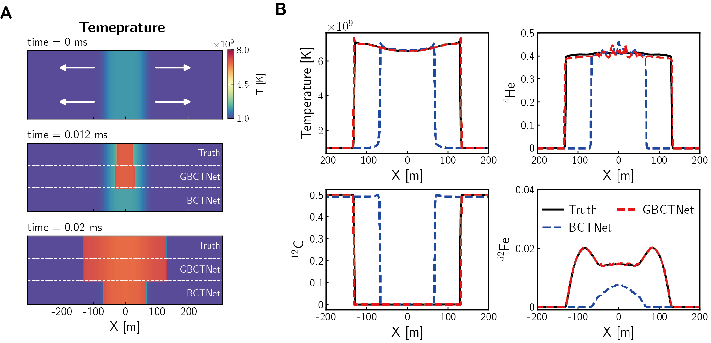
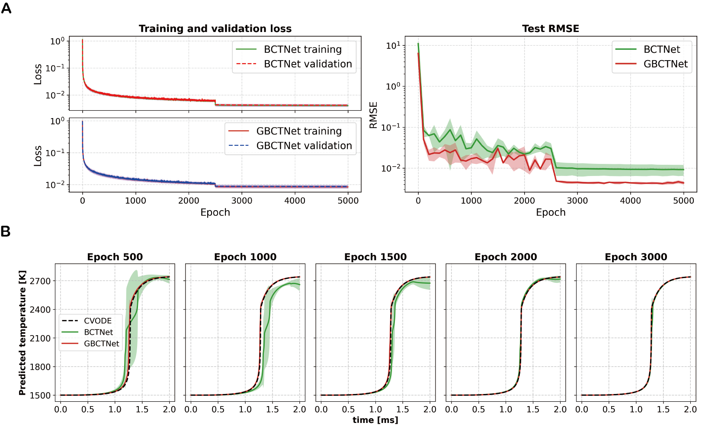

<h3 align="center">
GBCT: An Output Scaling Layer Boosts Deep Neural Networks for Multiscale ODE Systems
</h3>

    
  
  
  

<strong>An effective plug-and-play scaling module for solving stiff ODEs</strong>

  <a href="#quick-start"><strong>[Quick Start]</strong></a>

## Updates
- **[2025.12.01]** **GBCT** code is now open-source!

## Resources
We have open-sourced the full Datasets, Pre-trained Weights (Checkpoints), and Training/Inference scripts used in the paper.

| Case | Dataset | Checkpoint |
| :--- | :--- | :--- |
| **Chemical Reaction** | [Training Set](#) \| [Test Set](#) | [Download](#) |
| **Nuclear Reaction** | [Dataset](#) | [Download](#) |
| **Robertson Problem** | [Dataset](#) | [Download](#) |

## Introduction
We propose the Generalized Box–Cox Transformation (GBCT), a nonlinear scaling method that alleviates multiscale stiffness by compressing multi-magnitude data. Integrated into our data-driven framework, DeePODE, GBCT shows improved performance across diverse stiff ODE and PDE benchmarks.

## Key Features

- **Plug-and-Play:** Can be easily integrated into deep learning-based frameworks.
- **6x Faster Training:** Achieves comparable performance to baselines with only ~1/6 of the training epochs.
- **Long-Term Stability:** Effectively suppresses error accumulation in long-term time integration (up to 50,000 steps).
- **Versatility:** Validated on **chemical kinetics**, **nuclear reactions**, and the corresponding reaction-diffusion benchmarks.

## Major Results

We evaluated GBCTNet across six representative benchmarks, ranging from 0D stiff ODEs to 2D reacting flows.

### 1. Stiff Reaction Kinetics (0D)
In the **DRM19 (Methane reaction kinetics)** and **13-isotope nuclear networks**, GBCTNet significantly outperforms the BCTNet baseline.
* **Error Reduction:** Relative error for equilibrium temperature reduced from ~50% (Baseline) to **0.1%** (GBCTNet).
* **Stability:** Maintains trajectory stability over 50,000 time steps.

  

<em>Figure: Long-term temperature evolution comparison.</em>

### 2. Turbulent Combustion (2D)
In a 2D turbulent methane/air ignition case, GBCTNet accurately captures the flame structure and intermediate radicals.
* **Radical Prediction:** The maximum relative error for unstable radicals (e.g., H) is reduced from 274% (Baseline) to **100%** (GBCTNet).
* **Temperature Accuracy:** Relative error at $t=2ms$ is **4.8%** vs 17.8% for the baseline.

  

<em>Figure: 2D Turbulent flame snapshots.</em>

### 3. Nuclear Flame Propagation
In simulating a white dwarf's internal deflagration (nuclear flame):
* **Wave Speed:** GBCTNet accurately predicts the flame propagation velocity (~200 m/s) and ignition timing.
* **Morphology:** In the 2D wedge-shaped flame test, GBCTNet captures the sharp flame front with errors confined to a narrow band.

  

<em>Figure: 1D unsteady nuclear flame propagation.</em>

## Training Efficiency
GBCTNet converges significantly faster. It achieves low generalization error (RMSE) in the early training stages, requiring only **1/6th** of the epochs needed by the baseline to reach comparable accuracy.

  

<em>Figure: Training efficiency.</em>
